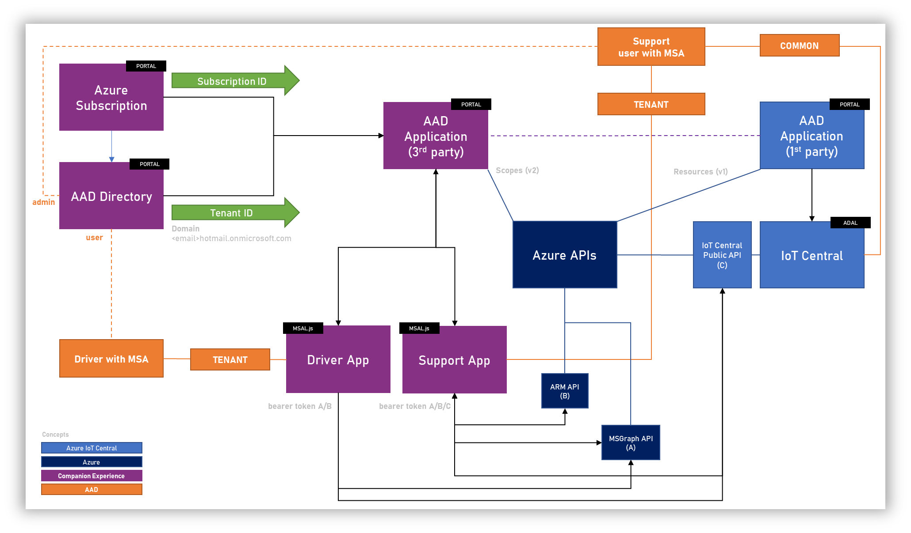
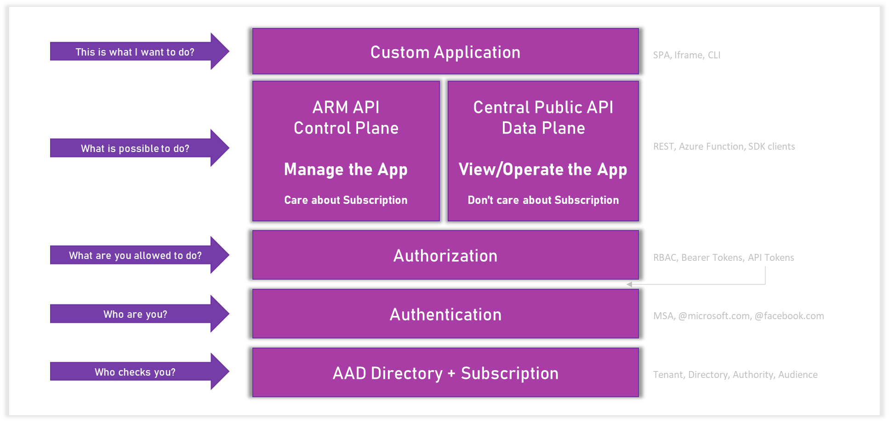
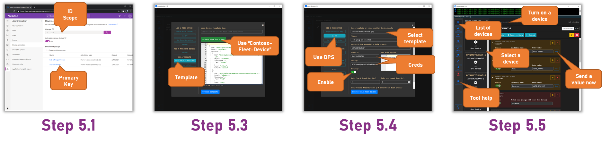

# Contoso-Drive Learning Path
This repo is a Learning Path to walk through how to build and deploy a set of IoT Central applications and IoT Central companion experiences to create an end to end solution for a Fleet management scenario.

## Companion Experience overview

Contoso-Drive is an example codebase and demonstration of an IoT Central Companion Experience. It's a codebase built around Fleet Management scenarios and leverages the Azure IoT Central REST APIs to communicate with the corresponding IoT Central applications.

[Watch a video of the Contoso-Drive experience here](https://youtu.be/icILa3Bdc28)

The Contoso-Drive Companion Experience is split into three concepts

* __The Support Portal.__ This application is an example of role specific scenarios for the technician/support person of Contoso-Drive. Typically this is a desktop application and is owned, managed and deployed by the Contoso-Drive company. Visit [this](https://github.com/iot-for-all/contoso-drive-support) repo to see the Support Portal.

* __The Driver App.__ This application represents the device that sends the vehicle's telematics to IoT Central which is subsequently available in the Support Portal. Typically this is a phone acting as a gateway and is run on the driver's mobile phone or an internet accessible device. Visit [this](https://github.com/iot-for-all/contoso-drive-simulator) repo to see the Drive App.

* __The IoT Central application(s).__ The main experience to manage the Contoso-Drive devices and admin level tasks for Contoso-Drive. It is typically used by the technician/support person and other privileged persons to perform admin level device management, insights and actions.

# Learning Path overview
The ultimate goal of the Learning Path is to introduce you to all the tech required to assemble a Companion Experience for your IoT Central application. The various supporting repos are examples of code that help you get familiar with API concepts for MS Graph, Azure Resource Management, IoT Central and their authentication and authorization requirements.

### Conceptual Architecture

The above diagram outlines the logical setup of a typical Companion Experience. The colors indicate where the efforts and responsibilities are. Though there are many concepts to become familiar with, the setup is pretty straight forward with most of the efforts being the actual Companion Experience itself.

### Authentication and authorization for Companion Experiences

The above diagram outlines the two authorization paths required for building Companion Experiences. In all scenarios the foundation layer is AAD. Once you get to thinking about the type of Companion Experience required, you will need to setup the AAD application accordingly. 

If IoT Central application information is required then calls need to be made to Azure Resource Manager or ARM. These are referred to as the __Control Plane__ APIs and can only be accessed by those with the ability to read information on the Subscription.

If solution information is required i.e. device data, calls need to be made to the Azure IoT Central Public APIs. These are referred as the __Data Plane__ APIs. In this scenario, app information such as host name needs to be provided or hard coded. A user just needs to have an AAD to authorize against and access to the IoT Central application itself.

If there is a need to separate the two types of privileges esp when moving to public, the recommendation is to use two different AAD applications. In all scenarios, users should all reside in the same Azure Active Directory (AAD)

# The Learning Path

This Learning Path will walk you through how to setup an end to end setup of an IoT Central Companion Experience. The instructions here are for a locahost setup. Please modify accordingly when deploying onto real services.

Before you get going with this Learning Path, please ensure you have admin access to your Azure Subscription. If you do not have an Azure Subscription, you should be able to use the free 12 months trial.

Through this Learning Path you will/may need to...

- Create an Azure Active Directory application
- Create an Azure Maps application
- Add users to the Azure Active Directory associated with the Azure Subscription

This Learning Path should take __40-50 minutes__ to complete.

## The steps

1. Setup the AAD application *__(15 mins)__*
    
   Use the following repo to setup the AAD application- [Setting up an AAD application to work with IoT Central](https://github.com/iot-for-all/iotc-aad-setup)

   Use the following repo to test the AAD application - [Test an AAD application](https://github.com/iot-for-all/iotc-aad-app)

2. Setup the IoT Central application(s) *__(5 mins each)__*

   Download the [Contoso-Fleet-Device](/Contoso-Fleet-Device.json) IoT Central device model. It is important to *not* change the display name of this device model when it is imported into IoT Central

   - Create a new custom IoT Central application using the same Azure Subscription
   - Create a new Device Template
     - Import the Contoso-Fleet-Device template into the application
   - Add two Cloud properties to the template. Case is important
     - __vehicleImage__ : string
     - __operator__ : string
   - Create a Form and add all read and writeable properties onto the Form
   - Create any desired dashboards
   - Publish the template
   - Repeat this for any number of IoT Central applications required

3. Setup the Contso-Drive Support application *__(10 mins)__*

   - Use the following repo to setup the [Support Application](https://github.com/iot-for-all/contoso-drive-support)
   - Sign into the Support Application   
   - Complete a driver registration. For this part of the step it is recommended to create a new user that can be part of the AAD. __Note the post completion information__.

4. Setup the Contso-Drive Driver application *__(5 mins)__*

   - Use the following repo to setup the [Driver Application](https://github.com/iot-for-all/contoso-drive-simulator)
   - Provide the registration completion information from Step 3
   - Sign into the Driver Application with the account from Step 3 and the app will automatically start simulating/sending data

__The following is an optional way to enhance the simulation experience__

5. Setup [mock-devices](https://github.com/codetunez/mock-devices) to simulate vehicles not being run by a Driver Application *__(15 minutes__*)

   *A simulated device in mock-devices will act and behave exactly like the Driver Application simulated device. You will not however need to provide any user identity and therefore its easier to scale.*

   - Step 1 - Get group enrollment information from the IoT Central Adminstration section
   - Step 2 - Clone the mock-devices [repo](https://github.com/codetunez/mock-devices) and follow the readme instructions to install, build and launch the app
   - Step 3 - In mock-devices, use "Add/Save" from the left menu and select "Add a template". Browse for the Contoso-Fleet-Device template downloaded and select create template
   - Step 4 - In mock-devices, use "Add/Save" from the left menu and select "Add a mock device->Use DPS". 
     - Select the Contoso-Fleet-Template
     - Enter any Device ID you desire. As this is device first registration, IoT Central will orchestrate the creation
     - Enter the ID Scope and SaS Key values for group enrollment and enable the Root Key toggle
     - Enter desired bulk values. mock-devices will automatically append a unique number to your Device ID (Please beware of your application billing quotas)
     - Create the devices. 
   - Step 5 - In mock-devices, use "Devices" from the left menu, select a device and power up. Devices will go through normal DPS provisioning/registration cycle. On devices are "connected" you can interact with them. mock-devices will automatically start sending data based on the DTDL schema. Use the tool help to learn more about changing values
   - Step 6 - In mock-devices, use "Add/Save" from the left menu and select "STATE -> Load/Save from file system". Save you current simulation configuration to save doing this setup again

 

Not all steps shown
